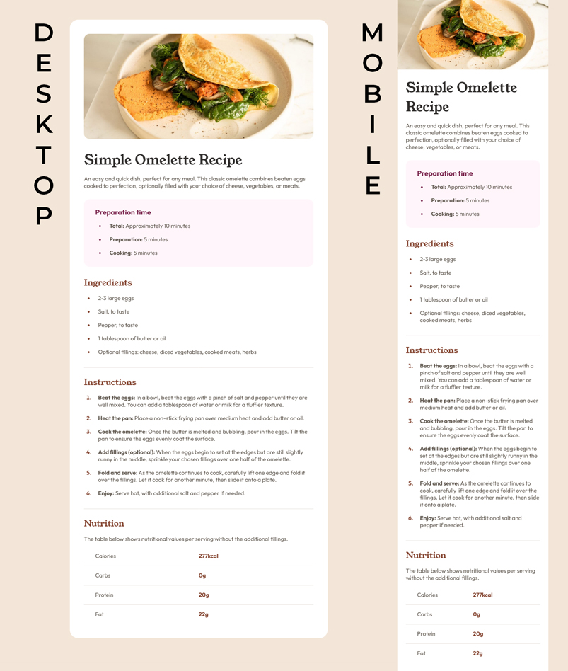

# Frontend Mentor - Recipe page solution

This is a solution to the [Recipe page challenge on Frontend Mentor](https://www.frontendmentor.io/challenges/recipe-page-KiTsR8QQKm/). Frontend Mentor challenges help you improve your coding skills by building realistic projects.

## Table of contents

-   [Overview](#overview)
    -   [The challenge](#the-challenge)
    -   [Screenshot](#screenshot)
    -   [Links](#links)
-   [My process](#my-process)
    -   [Built with](#built-with)
-   [Author](#author)

## Overview

### The challenge

The challenge is to build out the recipe page and get it looking as close to the design (image below) as possible.

### Screenshot

Below is the screenshot from my completed solution.

### Links

-   Solution URL: [Recipe Page on Netlify](https://UPDATELATER.netlify.app/)

## My process

### Built with

-   Semantic HTML5 markup
-   CSS custom properties
-   CSS Grid
-   Mobile-first workflow

## Author

-   Frontend Mentor - [@davejnicol](https://www.frontendmentor.io/profile/davejnicol)
